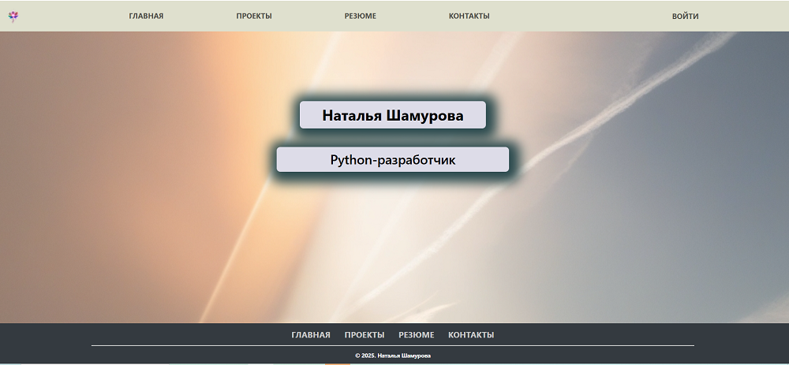
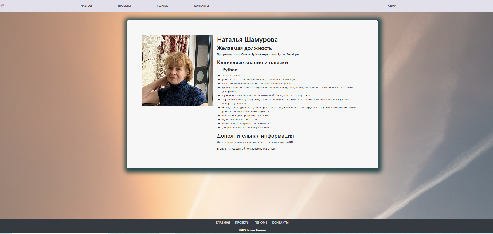
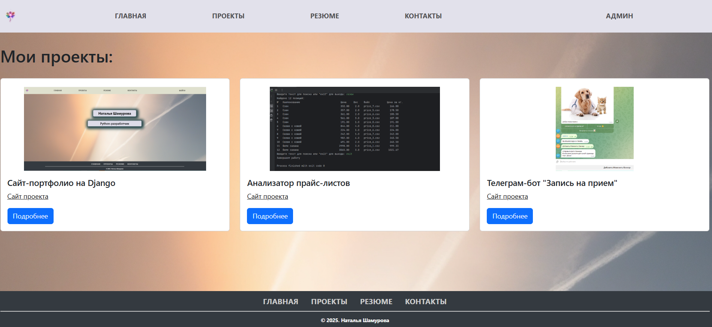
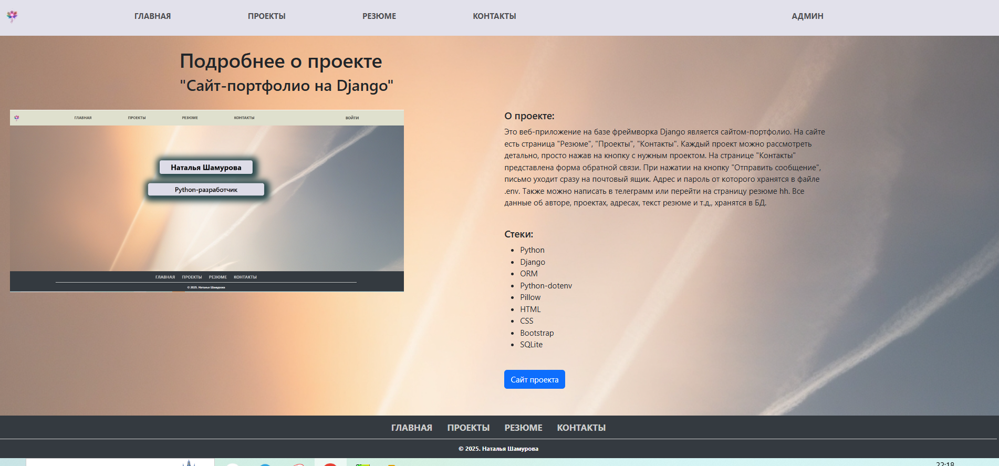
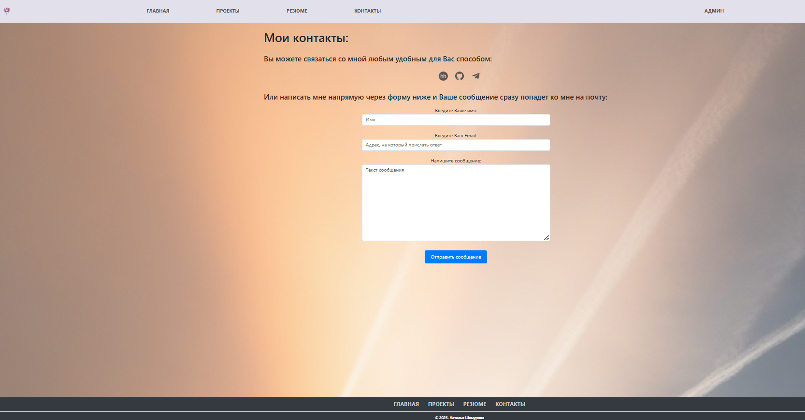

# Мой личный сайт-портфолио (Django)

 **Персональный сайт-портфолио, созданный с использованием фреймворка Django. Управление содержимым сайта производится через панель администратора. Весь контент: личная информация, проекты портфолио и ссылки  настраиваются в панели администратора.**
## Настройка и запуск 

 ### 1. Клонировать/скачать этот репозиторий
### 2. Создать файл .env, в который написать адрес почты и пароль от нее. (В кавычках - подставте свои данные. Файл обязательно поместить в  папку .gitignor) 
```bash
EMAIL_HOST_USER="Ваш email" 
EMAIL_HOST_PASSWORD="Ваш пароль"
EMAIL_HOST=smtp.gmail.ru
EMAIL_PORT=587
EMAIL_USE_TLS=True
```
Если надо использовать PosgreSQL вместо SQLite3, в файле .emv можно дописать: 
```bash
DATABASE_NAME="your_database_name"
DATABASE_USER="your_database_user"
DATABASE_PASSWORD="your_password"
```
И в settings.py изменить DATABASES:
```bash
DATABASES = {
    'default': {
        'ENGINE': 'django.db.backends.postgresql',
        'NAME': os.getenv('DATABASE_NAME'),
        'USER': os.getenv('DATABASE_USER'),
        'PASSWORD': os.getenv('DATABASE_PASSWORD'),
        'HOST': 'localhost',
        'PORT': '5432',
    }
}

```
### 3. Запустить в терминале:
```bash
pip install -r requirements.txt
python manage.py migrate
python manage.py createsuperuser
python manage.py runserver
```
### 4. Перейти по ссылке http://127.0.0.1:8000 на сайт:
  **Нажать на кнопку "Войти", чтобы войти в панель администратора и заполнить все таблицы своими данными.**


---
## Технологии:

- **Python**
- **Django** 
- **ORM** 
- **Python-dotenv** 
- **Pillow** 
- **HTML/CSS** 

- **Bootstrap**
- **SQLite3**

## Скриншоты сайта:
- ### Первая страница - приветственная:
 

- ### Резюме:
   
 **Страница, содержащая информацию о владельце сайта, его опыте и навыках.**
- ### Проекты:
   
**Страница, на которой отображается список проектов портфолио со ссылкой на код и кнопка для перехода на 
его подробное описание.**
- ### Подробнее о проекте: 
   
**Страница, на которой отображаются сведения об одном проекте портфолио, включая название, описание,
соответствующие изображения и ссылку на код.**
- ### Контакты: 
   
**Страница, на которой отображаются возможные контакты, а также форма для прямой отправки сообщений на почту, указанную в файле .env.**
---

